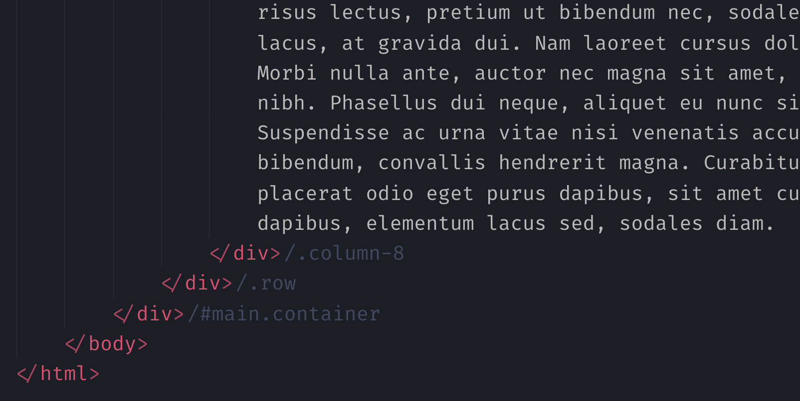

# HTML End Tag Labels

  

 

 

Labels HTML end tags in VSCode.

## Features

## Theme colors

| Name                        | Description            |
| --------------------------- | ---------------------- |
| htmlEndTagLabels.labelColor | Label foreground color |

## Settings

| Name                         | Description                 |
| ---------------------------- | --------------------------- |
| htmlEndTagLabels.labelPrefix | Label prefix (default: `/`) |

> **Warning**: The following settings are deprecated and will be removed in a future release. Use theme colors instead.

| Name                            | Description                                                                         |
| ------------------------------- | ----------------------------------------------------------------------------------- |
| ~~htmlEndTagLabels.labelColor~~ | ~~Label foreground color (if empty will use `editorCodeLens.foreground` instead).~~ |

## [Release Notes](CHANGELOG.md)
